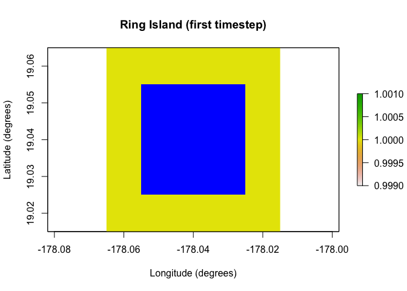
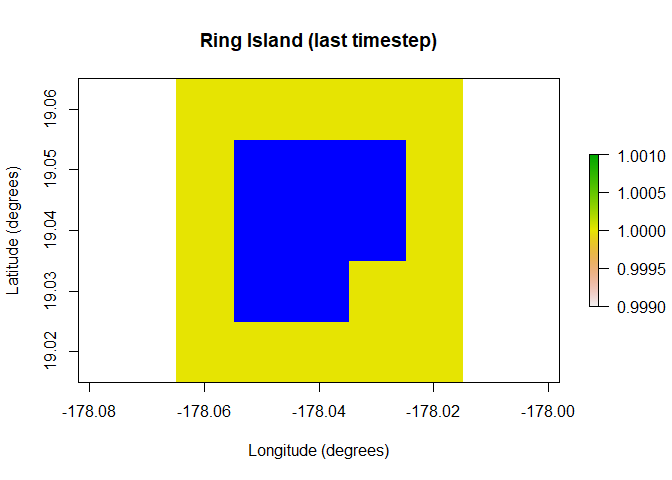
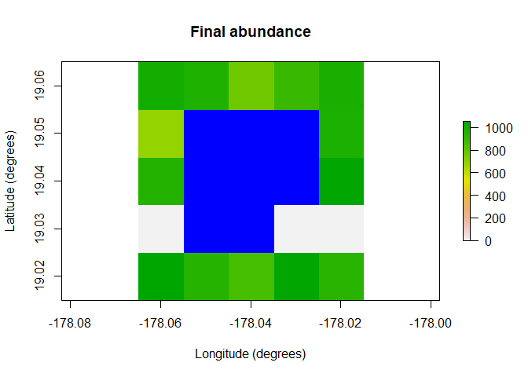

<!-- README.md is generated from README.Rmd. Please edit that file -->

# paleopop

<!-- badges: start -->

[](https://github.com/GlobalEcologyLab/paleopop/actions)
<!-- badges: end -->

`paleopop` is an extension to `poems`, a spatially-explicit,
process-explicit, pattern-oriented framework for modeling population
dynamics. This extension adds functionality for modeling large
populations at generational time-steps over paleontological time-scales.

## Installation

You can install the development version from
[GitHub](https://github.com/) with:

``` r
# install.packages("devtools")
devtools::install_github("GlobalEcologyLab/paleopop")
```

## Example

One of the major additions in `paleopop` is the `PaleoRegion` R6 class,
which allows for regions that change over time due to ice sheets, sea
level, bathymetry, and so on.

``` r
library(poems)
library(paleopop)
coordinates <- data.frame(x = rep(seq(-178.02, -178.06, -0.01), 5),
                          y = rep(seq(19.02, 19.06, 0.01), each = 5))
template_raster <- Region$new(coordinates = coordinates)$region_raster # full extent
sealevel_raster <- template_raster
template_raster[][c(7:9, 12:14, 17:19)] <- NA # make Ring Island
sealevel_raster[][c(7:9, 12:14, 17:18)] <- NA
raster_stack <- raster::stack(x = append(replicate(9, template_raster), sealevel_raster))
region <- PaleoRegion$new(template_raster = raster_stack)
raster::plot(region$temporal_mask_raster()[[1]], main = "Ring Island (first timestep)",
             xlab = "Longitude (degrees)", ylab = "Latitude (degrees)",
             colNA = "blue", legend = F)
```



``` r
raster::plot(region$temporal_mask_raster()[[10]], main = "Ring Island (last timestep)",
             xlab = "Longitude (degrees)", ylab = "Latitude (degrees)",
             colNA = "blue", legend = F)
```



`paleopop` also includes the `PaleoPopModel` class for running
simulations over paleo time scales, and the `PaleoPopResults` class for
storing the outputs from the paleo population simulator.

``` r
model_template <- PaleoPopModel$new(
  region = region,
  time_steps = 10,
  years_per_step = 12, # years per generational time-step
  standard_deviation = 0.1,
  growth_rate_max = 0.6,
  harvest = F,
  populations = region$region_cells,
  initial_abundance = seq(9000, 0, -1000),
  transition_rate = 1.0,
  carrying_capacity = rep(1000, 17),
  dispersal = (!diag(nrow = 17, ncol = 17))*0.05,
  density_dependence = "logistic",
  dispersal_target_k = 10,
  occupancy_threshold = 1, 
  abundance_threshold = 10,
  results_selection = c("abundance")
)

results <- paleopop_simulator(model_template)
results # examine
#> $abundance
#>       [,1] [,2] [,3] [,4] [,5] [,6] [,7] [,8] [,9] [,10]
#>  [1,]    0    0    0    0    0    0    0    0    0     0
#>  [2,]    0    0    0    0    0    0    0    0    0     0
#>  [3,]   33   50   62  107  170  300  441  575  798   846
#>  [4,]   30   60   90  160  270  358  457  705  979   896
#>  [5,]  310  416  527  663  744  968 1058  946 1013   951
#>  [6,]  510  623  732  900  831  920 1135  809 1122   879
#>  [7,]  758  914  903 1019  846  978 1069 1200  962   914
#>  [8,]  901 1078 1062 1040  909  902  970  831  735   794
#>  [9,] 1133 1177 1069  918  947  929 1207 1056 1178  1013
#> [10,]    0    0    0    0    0    0    0    0    0     0
#> [11,]   13   23   32   67  119  209  379  558  780   941
#> [12,]   13   21   24   55  110  173  284  484  620   807
#> [13,]   77  150  241  396  543  763  856  965  977   898
#> [14,]   16   28   52   92  153  292  436  602  734   830
#> [15,]   38   62  112  177  284  427  591  713  796   723
#> [16,]  393  631  680  835  864  962 1040  947 1214   986
#> [17,] 1300 1061  962 1005  853 1053 1027 1071  830   857
raster::plot(region$raster_from_values(results$abundance[,10]),
             main = "Final abundance", xlab = "Longitude (degrees)", 
             ylab = "Latitude (degrees)", colNA = "blue")
```



A practical example of how to use `paleopop`, with more complex
parameterization, can be found in the vignette.
