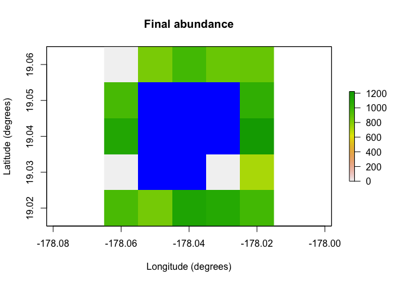

<!-- README.md is generated from README.Rmd. Please edit that file -->

# paleopop 

<!-- badges: start -->

[](https://doi.org/10.1111/geb.13601)
[](https://github.com/GlobalEcologyLab/paleopop/actions)
[](https://CRAN.R-project.org/package=paleopop)
[](https://CRAN.R-project.org/package=paleopop)
[](https://github.com/GlobalEcologyLab/paleopop/commits/master)
<!-- badges: end -->

`paleopop` is part of the poemsverse. `poems` is a spatially-explicit,
process-explicit, pattern-oriented framework for modeling population
dynamics. This extension adds functionality for modeling large
populations at generational time-steps over paleontological time-scales.

## Installation

You can install the latest release of `paleopop` from CRAN with:

``` r
install.packages("paleopop")
#> Installing package into '/private/var/folders/bj/97tw86zd3r9d65sl59y8sf600000gn/T/Rtmpu6MN0v/temp_libpath1688913f63057'
#> (as 'lib' is unspecified)
#> 
#> The downloaded binary packages are in
#>  /var/folders/bj/97tw86zd3r9d65sl59y8sf600000gn/T//RtmpH6MILv/downloaded_packages
```

You can install the development version from
[GitHub](https://github.com/) with:

``` r
# install.packages("devtools")
devtools::install_github("GlobalEcologyLab/paleopop")
```

## About R6 classes

`poems` and `paleopop` are based on
[R6](https://r6.r-lib.org/articles/Introduction.html "R6 reference")
class objects. R is primarily a *functional* programming language; if
you want to simulate a population, you might use the `lapply` or
`replicate` functions to repeat a generative function like `rnorm`. R6
creates an *object-oriented* programming language inside of R, so
instead of using functions on other functions, in these packages we
simulate populations using methods attached to objects. Think of R6
objects like machines, and methods like switches you can flip on the
machines.

## Example

One of the major additions in `paleopop` is the `PaleoRegion` R6 class,
which allows for regions that change over time due to ice sheets, sea
level, bathymetry, and so on. The plots below show the temporal mask
functionality of the `PaleoRegion` object. The temporal mask indicates
cells that are occupiable at each time step with a 1 and unoccupiable
cells with a `NA`. In this example, I use the `temporal_mask_raster`
method to show how “Ring Island” changes at time step 10 due to a drop
in sea level.

``` r
library(poems)
library(paleopop)
coordinates <- data.frame(x = rep(seq(-178.02, -178.06, -0.01), 5),
                          y = rep(seq(19.02, 19.06, 0.01), each = 5),
                          z = rep(1, 25))
template_raster <- raster::rasterFromXYZ(coordinates, 
                                         crs = "+proj=longlat +datum=WGS84 +ellps=WGS84 +towgs84=0,0,0")
sealevel_raster <- template_raster
template_raster[][c(7:9, 12:14, 17:19)] <- NA # make Ring Island
sealevel_raster[][c(7:9, 12:14, 17:18)] <- NA
raster_stack <- raster::stack(x = append(replicate(9, template_raster), sealevel_raster))
region <- PaleoRegion$new(template_raster = raster_stack)
raster::plot(region$temporal_mask_raster()[[1]], main = "Ring Island (first timestep)",
             xlab = "Longitude (degrees)", ylab = "Latitude (degrees)",
             colNA = "blue")
```


``` r
raster::plot(region$temporal_mask_raster()[[10]], main = "Ring Island (last timestep)",
             xlab = "Longitude (degrees)", ylab = "Latitude (degrees)",
             colNA = "blue")
```


`paleopop` also includes the `PaleoPopModel` class, which sets up the
population model structure. Here I show a very minimalist setup of a
model template using this class.

``` r
model_template <- PaleoPopModel$new(
  region = region, # makes the simulation spatially explicit
  time_steps = 10, # number of time steps to simulate
  years_per_step = 12, # years per generational time-step
  standard_deviation = 0.1, # SD of growth rate
  growth_rate_max = 0.6, # maximum growth rate
  harvest = F, # are the populations harvested?
  populations = 17, # total occupiable cells over time
  initial_abundance = seq(9000, 0, -1000), # initial pop. sizes
  transition_rate = 1.0, # transition rate between generations
  carrying_capacity = rep(1000, 17), # static carrying capacity
  dispersal = (!diag(nrow = 17, ncol = 17))*0.05, # dispersal rates
  density_dependence = "logistic", # type of density dependence
  dispersal_target_k = 10, # minimum carrying capacity to attract dispersers
  occupancy_threshold = 1, # lower than this # of pops. means extinction
  abundance_threshold = 10, # threshold for Allee effect
  results_selection = c("abundance") # what outputs do you want in results?
)
```

The `paleopop_simulator` function accepts a PaleoPopModel object or a
named list as input to simulate populations over paleo time scales, and
the `PaleoPopResults` class stores the outputs from the paleo population
simulator.

``` r
results <- paleopop_simulator(model_template)
results # examine
#> $abundance
#>       [,1] [,2] [,3] [,4] [,5] [,6] [,7] [,8] [,9] [,10]
#>  [1,]    0    0    0    0    0    0    0    0    0     0
#>  [2,]   16   25   42   97  154  229  312  532  705   825
#>  [3,]  137  204  291  447  632  790  805  893 1153   979
#>  [4,]   23   35   65  121  189  281  441  587  700   863
#>  [5,]   74  121  222  342  492  637  809  941  990   866
#>  [6,] 1468 1261 1125 1007  964  971  811  992  924   963
#>  [7,] 1099 1015  909 1044  900 1131  933 1063  996  1043
#>  [8,] 1398 1279 1285 1056  997 1214 1354  969  960  1113
#>  [9,] 1195 1142 1073 1010 1067 1390 1209  996  979  1223
#> [10,]    0    0    0    0    0    0    0    0    0     0
#> [11,]    0    0    0    0    0    0    0    0    0     0
#> [12,]   11   23   33   60  115  219  328  446  602   717
#> [13,]  151  215  360  413  522  675  854  829  819   952
#> [14,]  288  452  690  849  789  854  959  862  723   833
#> [15,]  450  617  847  852  866  865  870  936 1206  1131
#> [16,]  766  886  964  929 1043  903 1210 1154 1177  1097
#> [17,]  910  892  968  925 1071 1050 1058  935  754   976
raster::plot(region$raster_from_values(results$abundance[,10]),
             main = "Final abundance", xlab = "Longitude (degrees)", 
             ylab = "Latitude (degrees)", colNA = "blue")
```



A practical example of how to use `paleopop`, with more complex
parameterization, can be found in the vignette.

## Citation

You may cite `paleopop` in publications using our software paper in
*Global Ecology and Biogeography*:

Pilowsky, J. A., Haythorne, S., Brown, S. C., Krapp, M., Armstrong, E.,
Brook, B. W., Rahbek, C., & Fordham, D. A. (2022). Range and extinction
dynamics of the steppe bison in Siberia: A pattern‐oriented modelling
approach. *Global Ecology and Biogeography*, *31*(12), 2483-2497.
