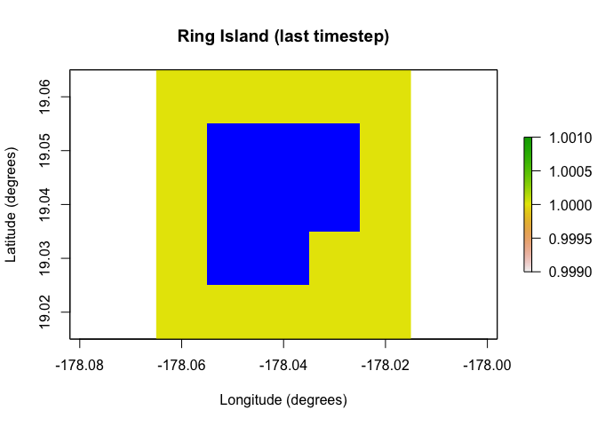

<!-- README.md is generated from README.Rmd. Please edit that file -->

# paleopop

<!-- badges: start -->

[](https://github.com/GlobalEcologyLab/paleopop/actions)

[](https://CRAN.R-project.org/package=paleopop)

[](https://CRAN.R-project.org/package=paleopop)
<!-- badges: end -->

`paleopop` is an extension to `poems`, a spatially-explicit,
process-explicit, pattern-oriented framework for modeling population
dynamics. This extension adds functionality for modeling large
populations at generational time-steps over paleontological time-scales.

## Installation

You can install the development version from
[GitHub](https://github.com/) with:

``` r
# install.packages("devtools")
devtools::install_github("GlobalEcologyLab/paleopop")
```

## About R6 classes

`poems` and `paleopop` are based on
[R6](https://r6.r-lib.org/articles/Introduction.html "R6 reference")
class objects. R is primarily a *functional* programming language; if
you want to simulate a population, you might use the `lapply` or
`replicate` functions to repeat a generative function like `rnorm`. R6
creates an *object-oriented* programming language inside of R, so
instead of using functions on other functions, in these packages we
simulate populations using methods attached to objects. Think of R6
objects like machines, and methods like switches you can flip on the
machines.

## Example

One of the major additions in `paleopop` is the `PaleoRegion` R6 class,
which allows for regions that change over time due to ice sheets, sea
level, bathymetry, and so on. The plots below show the temporal mask
functionality of the `PaleoRegion` object. The temporal mask indicates
cells that are occupiable at each time step with a 1 and unoccupiable
cells with a `NA`. In this example, I use the `temporal_mask_raster`
method to show how “Ring Island” changes at time step 10 due to a drop
in sea level.

``` r
library(poems)
library(paleopop)
coordinates <- data.frame(x = rep(seq(-178.02, -178.06, -0.01), 5),
                          y = rep(seq(19.02, 19.06, 0.01), each = 5),
                          z = rep(1, 25))
template_raster <- raster::rasterFromXYZ(coordinates, 
                                         crs = "+proj=longlat +datum=WGS84 +ellps=WGS84 +towgs84=0,0,0")
sealevel_raster <- template_raster
template_raster[][c(7:9, 12:14, 17:19)] <- NA # make Ring Island
sealevel_raster[][c(7:9, 12:14, 17:18)] <- NA
raster_stack <- raster::stack(x = append(replicate(9, template_raster), sealevel_raster))
region <- PaleoRegion$new(template_raster = raster_stack)
raster::plot(region$temporal_mask_raster()[[1]], main = "Ring Island (first timestep)",
             xlab = "Longitude (degrees)", ylab = "Latitude (degrees)",
             colNA = "blue")
```


``` r
raster::plot(region$temporal_mask_raster()[[10]], main = "Ring Island (last timestep)",
             xlab = "Longitude (degrees)", ylab = "Latitude (degrees)",
             colNA = "blue")
```



`paleopop` also includes the `PaleoPopModel` class, which sets up the
population model structure. Here I show a very minimalist setup of a
model template using this class.

``` r
model_template <- PaleoPopModel$new(
  region = region, # makes the simulation spatially explicit
  time_steps = 10, # number of time steps to simulate
  years_per_step = 12, # years per generational time-step
  standard_deviation = 0.1, # SD of growth rate
  growth_rate_max = 0.6, # maximum growth rate
  harvest = F, # are the populations harvested?
  populations = 17, # total occupiable cells over time
  initial_abundance = seq(9000, 0, -1000), # initial pop. sizes
  transition_rate = 1.0, # transition rate between generations
  carrying_capacity = rep(1000, 17), # static carrying capacity
  dispersal = (!diag(nrow = 17, ncol = 17))*0.05, # dispersal rates
  density_dependence = "logistic", # type of density dependence
  dispersal_target_k = 10, # minimum carrying capacity to attract dispersers
  occupancy_threshold = 1, # lower than this # of pops. means extinction
  abundance_threshold = 10, # threshold for Allee effect
  results_selection = c("abundance") # what outputs do you want in results?
)
```

The `paleopop_simulator` function accepts a PaleoPopModel object or a
named list as input to simulate populations over paleo time scales, and
the `PaleoPopResults` class stores the outputs from the paleo population
simulator.

``` r
results <- paleopop_simulator(model_template)
results # examine
#> $abundance
#>       [,1] [,2] [,3] [,4] [,5] [,6] [,7] [,8] [,9] [,10]
#>  [1,]    0    0    0    0    0    0    0    0    0     0
#>  [2,]    0    0    0    0    0    0    0    0    0     0
#>  [3,]  133  204  364  609  875  773  878  932 1164   990
#>  [4,]  189  348  584  757  884  991 1105  938 1114   888
#>  [5,]  208  286  464  701  830 1028  823  819  819  1039
#>  [6,]  695  721  894 1003  980  935  987 1043  892   932
#>  [7,]  921  840  957  966  832  923  916  864  859   903
#>  [8,]  782  806  953 1017 1014 1029  958  994  959   872
#>  [9,]  888 1138  896  893 1015  996 1063 1015  994  1046
#> [10,]    0    0    0    0    0    0    0    0    0     0
#> [11,]    0    0    0    0    0    0    0    0    0     0
#> [12,]   19   34   54  115  204  326  489  607  664   913
#> [13,]  354  497  609  842  990  768  845  974 1072   833
#> [14,]  104  189  325  466  745  829  948 1079 1084  1020
#> [15,] 1184 1020  898  890 1046 1021 1074  983  975   936
#> [16,]  232  353  494  651  717  858  969 1055 1072  1128
#> [17,]  863  881 1022  890  886 1022  933  807  915   887
raster::plot(region$raster_from_values(results$abundance[,10]),
             main = "Final abundance", xlab = "Longitude (degrees)", 
             ylab = "Latitude (degrees)", colNA = "blue")
```


A practical example of how to use `paleopop`, with more complex
parameterization, can be found in the vignette.
